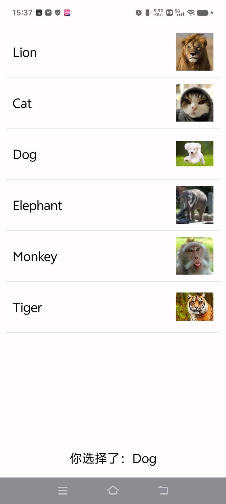
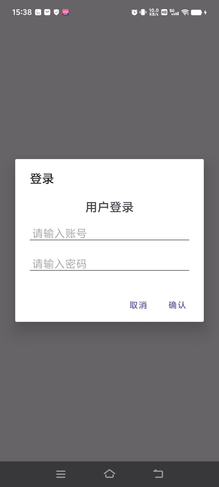
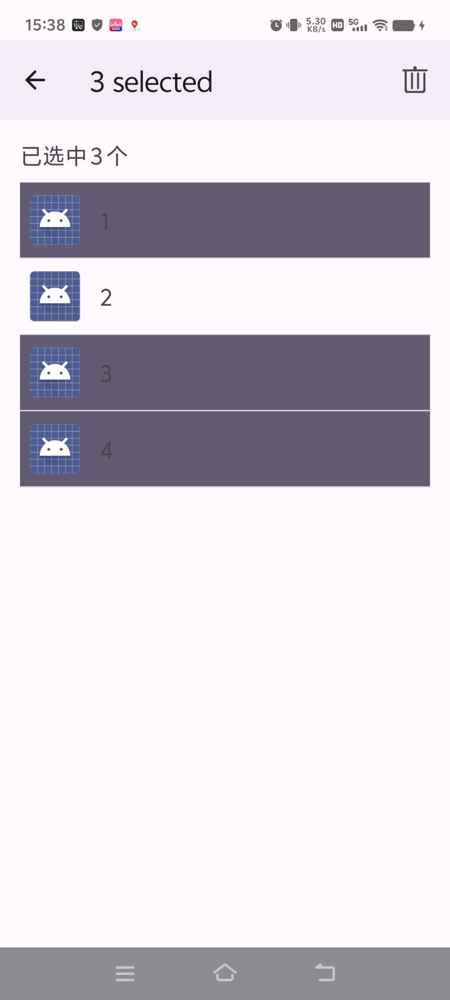
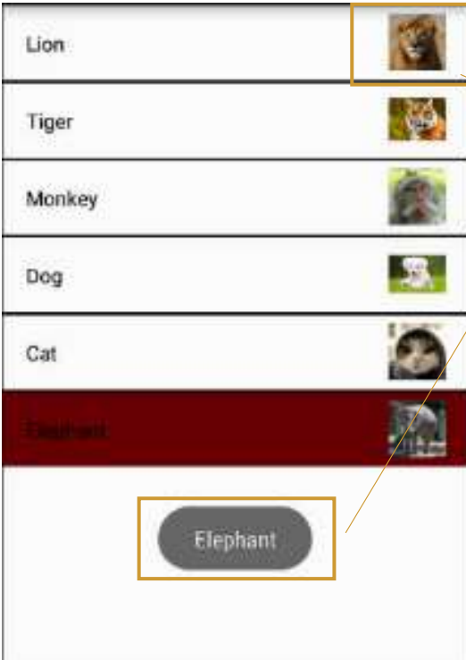
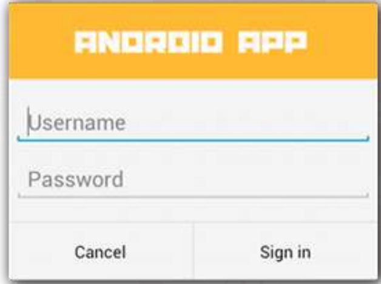
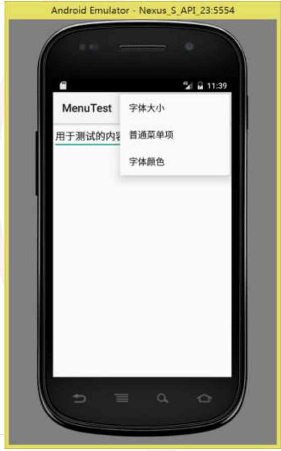
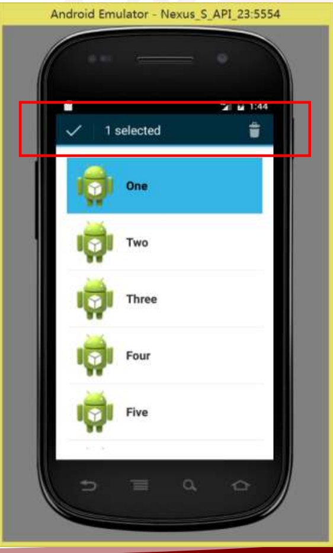

# 实验3
> 实现布局和功能要求
> 1. SimpleAdapter实现要求
（1）注意列表项的布局
（2）图片使用QQ群附件资源
（3）使用Toast显示选中的列表项信息
（4）单击某个列表项后，发送一条通
知，通知的图片（Icon）为应用程序图
标，显示的Title为列表项内容，通知内
容自拟。

> 2. 请创建一个如图所示的布局，调 用 AlertDialog.Builder 对象上的 setView() 将 布 局 添 加 到
AlertDialog。

> 3. 字体大小（有小，中，大这3个选项；分别
对应10号字，16号字和20号字）；点击之
后设置测试文本的字体
• 普通菜单项，点击之后弹出Toast提示
• 字体颜色（有红色和黑色这2个选项），点
击之后设置测试文本的字体

> 4. 创建如图模式的上下文菜单
• 使用ListView或者ListActivity创建List
• 为List Item创建ActionMode形式的
上下文菜单

## 1. 运行环境
- Android Studio 2025.1.3（Koala / Narwhal 系列）
- Kotlin / Jetpack Compose / Material 3
- Room (SQLite) + MVVM + Navigation
- minSdk 24，targetSdk 36

## 2. 项目结构
app/src/main/java/com/example/program3
├─ MainActivity.java　# 列表
├─ DialogDemoActivity.java　# 对话框
├─ ListActionModeActivity.java　选择列表
└─ MenuDemoActivity.java　# 菜单

## 3. 功能清单（对齐实验要求）
| 实验要求编号 | 对应文件                                   | 功能展示                                                                  |
| ------ | -------------------------------------- | --------------------------------------------------------------------- |
| 1      | **MainActivity.java**　# 列表             |                                     |
| 2      | **DialogDemoActivity.java**　# 对话框      |   |
| 3      | **ListActionModeActivity.java**　# 选择列表 |                                     |
| 4      | **MenuDemoActivity.java**　# 菜单         |   |

## 4. 关键实现思路（简述）
1. String[] names 和 int[] images 列表和图片名字，通过点击事件 listView.setOnItemClickListener 来实现

2. builder.setPositiveButton 来显示对话框

3. private String[] items存储1234，4个cell，private MyAdapter adapter 记录已经选中几个

4. private void showPopupMenu 作为菜单，public boolean onMenuItemClick(MenuItem item)
                int id = item.getItemId(); 代表每一个选项，选择后会把结果反映到测试文本 private TextView tvTest;

## 5. 快速上手
1) 用 Android Studio 打开工程，等待 Gradle Sync 完成。
2) 连接真机或启动模拟器，选择想看的界面点击 **Run ▶**。
3) 根据实验要求进行点击操作，测试功能

## 6. 实验总结（示例文字，可直接保留）

- 本次实验综合运用了列表、对话框、选择模式与菜单等常见组件，掌握了 Android 中多种交互界面的实现方法。通过使用 ListView 与自定义适配器实现数据展示、AlertDialog 构建对话框交互、ActionMode 管理多选操作、PopupMenu 完成菜单响应，进一步理解了事件监听与组件间数据传递机制。实验过程中提升了对 UI 控件生命周期与用户交互逻辑的理解，为后续更复杂的界面开发奠定了良好基础。

## 7. 参考（来自实验PDF给出的参考方向）

- 以下是来自pdf的参考样本

